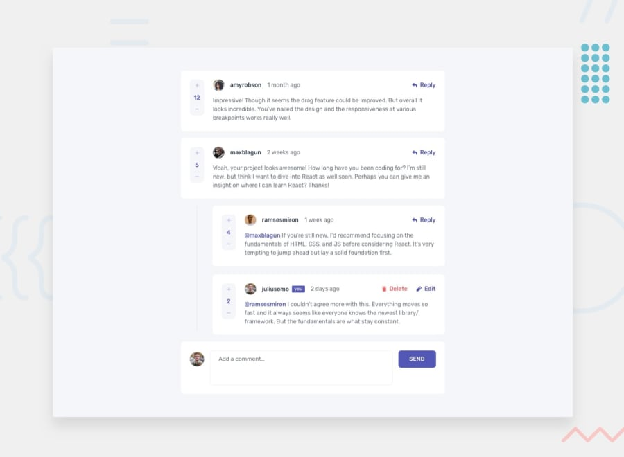

# CRUD Application (Comments and Replies Section).



Comments Section Application is a simple project for CRUD Operations:

#### Live Demo For the Project on vercel:

[](https://front-end-mentor-ten-beige.vercel.app/)

## Technologies used

-   [Reactjs](https://reactjs.org/)
-   [TypeScript](https://www.typescriptlang.org/)
-   [Redux Tookit](https://redux-toolkit.js.org/)
-   [Sass](https://sass-lang.com/)
-   [React Hook Form](https://react-hook-form.com/)
-   [Axios](https://axios.com)

## Getting started

-   First Clone the repo:

```shell
git clone https://github.com/markosbahgat/CRUD-APP-Comments-and-Replies-Section-.git
```

-   Second Install the dependencies:

```shell
npm install
```

-   it's time to start the server:

```shell
npm start
```

Now you should see a message in the terminal like this one:


## Feature set

| Feature                                                             | Status |
| ------------------------------------------------------------------- | ------ |
| Append New Comment                                                  | ✅     |
| Append New Reply                                                    | ✅     |
| Edit, Update Any Reply or Comment                                   | ✅     |
| Delete Any Comment or reply                                         | ✅     |
| Responsive to all Screens                                           | ✅     |
| Application get's it's initialData from `data.json` file            | ✅     |
| Single Source of Truth (Redux Store)                                | ✅     |
| Using TypeScript For Type Checking                                  | ✅     |
| Clean Code and Reusable Components approach are applied to the code | ✅     |

## Reach out for Markos Bahgat

[](https://twitter.com/bahgat_markos)

> [_Portofolio Website_](https://markosbahgat.com)  
> [_LinkedIn Profile_](https://www.linkedin.com/in/markos-bahgat-9a7178216)  
> [_Phone Number Or WhatsApp_]() : ` +201208444364`
